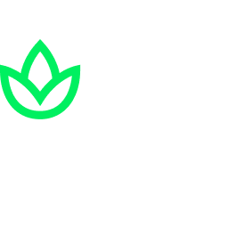
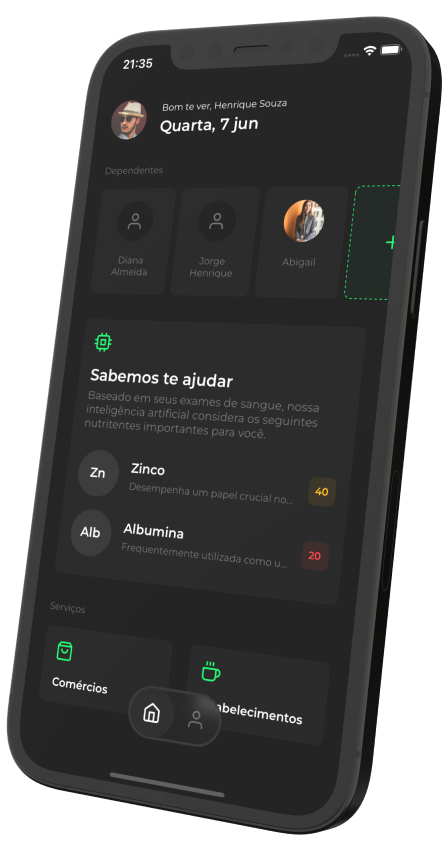

<br>

<h1 align="center">
  
</h1>

<br>

<p align="center">
  <a href="#-Sobre">Sobre</a>
  &nbsp;&nbsp;&nbsp;|&nbsp;&nbsp;&nbsp;
  <a href="#-Tecnologias">Tecnologias</a>
  &nbsp;&nbsp;&nbsp;|&nbsp;&nbsp;&nbsp;
  <a href="#-Funcionalidades">Funcionalidades</a>
  &nbsp;&nbsp;&nbsp;|&nbsp;&nbsp;&nbsp;
  <a href="#-Como-usar">Como usar</a>
  &nbsp;&nbsp;&nbsp;|&nbsp;&nbsp;&nbsp;
  <a href="#-Colaboradores">Colaboradores</a>
</p>

<p align="center">
  
  
</p>

<p align="center">
  
</p>

### 🤳 Sobre

O Nutria chega ao mercado como um aplicativo que une o uso de dados pessoais e laboratoriais, parcerias com empresas, instituições, organizações e inteligência artificial, visando ser um importante aliado no combate à subnutrição/desnutrição que assola o Brasil e o mundo.

O aplicativo será responsável por fornecer uma ficha de nutrição que será desenvolvida através de inteligência artificial treinada para identificar carências em nutrientes através do cruzamentos de dados de resultados de exames laboratoriais, histórico médico e características demográficas, para então identificar usuários que possam estar ou já estão em situação de vulnerabilidade nutricional e possibilitar a sugestão de quais alimentos devem ser consumidos para auxiliar a suprir essa carência através da alimentação.

Clique [aqui](https://www.figma.com/file/xuMhTj8OpK41HE2L8A5ZNM/Beehive-%2B-GS?type=design&node-id=607%3A2&t=UKwFw1JlMsz7MnO8-1) para ver o wireframe no **Figma**.

<br>

### 🚀 Tecnologias

- [Expo](https://www.php.net/)
- [Axios](https://axios-http.com/)
- [chroma.js](https://gka.github.io/chroma.js/)
- [moment.js](https://momentjs.com/)
- [AsyncStorage](https://github.com/react-native-async-storage/async-storage#readme)
- [Toast Message](https://github.com/calintamas/react-native-toast-message)
- [Mask Input](https://github.com/CaioQuirinoMedeiros/react-native-mask-input)
- [Maps](https://github.com/react-native-maps/react-native-maps)
- [React Navigation](https://reactnavigation.org/)

<br>

### 🪄 Funcionalidades

- Navegações Stack e Bottom Tab
- Login
- Logout
- Theme switcher
- Persistência de informações
- Criação de exames e dependentes

<br>

### 🧑‍💻 Como usar

**Ante de tudo:** o [NodeJS](https://nodejs.org/en/download) deve estar instalado na máquina. Você pode utilizar qualquer gerenciador de pacotes.

```bash
# Clone o repositório

$ git clone https://github.com/BeehiveCorp/nutria-app.git
```

```bash
# Instale as dependências

$ yarn install
```

```bash
# Rode o servidor

$ yarn start
```

<br>

### 🧑‍💻 Colaboradores

- [David Almeida Santos](https://www.linkedin.com/in/almeida154/) (RM96033)
- [Eduardo Juhn Shimizu](https://www.linkedin.com/in/eduardo-shimizu/) (RM93199)
- [Isabella Venancio Bazzi](https://www.linkedin.com/in/isabellabazzi/) (RM93545)
- Lina Maria Fazia Teixeira (RM94303)
- [Vylle da Silva Menezes](https://www.linkedin.com/in/vylle-menezes/) (RM96097)
